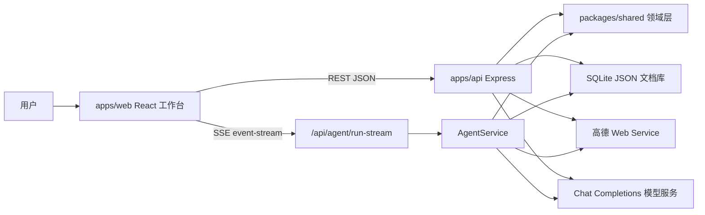
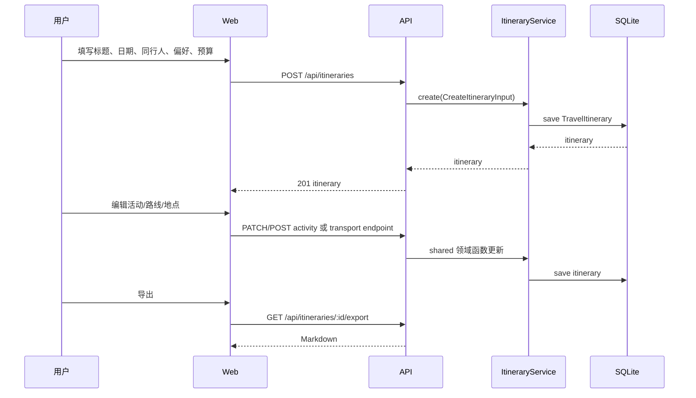
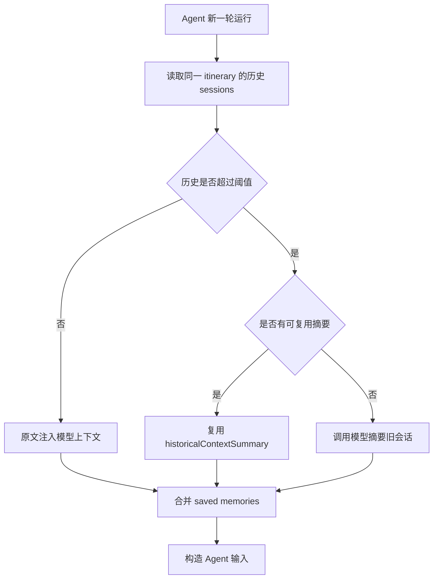
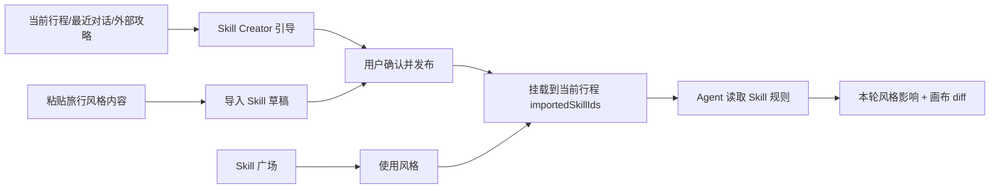

# 详细设计文档

## 1. 设计目标

本系统把旅行规划 Agent 从一次性文本问答推进为可编辑、可恢复、可复用的工作台。详细设计围绕四个目标展开：

- 结构化产物：Agent 和用户都操作同一份 `TravelItinerary`，避免自然语言结果和画布状态分裂。
- 工具化规划：地点、路线、天气、时间风险、Skill、记忆都通过后端服务封装，前端只呈现用户可理解的规划动作。
- 跨对话连续性：历史会话、上下文压缩和 saved memories 共同支持后续 Agent 继续使用用户偏好。
- 可复盘优化：session、trace 和评估数据集保留 Agent 运行证据，但普通工作台不暴露内部 tool call 细节。

## 2. 总体架构

系统采用 TypeScript monorepo：

```text
se3-iter3/
  apps/web/          React + Vite + Tailwind 前端工作台
  apps/api/          Express API、SQLite、Agent、Skill、Map、Memory 服务
  packages/shared/   前后端共享的领域类型、行程规则、Skill 规则和导出逻辑
  data/evaluation/   Agent 优化评估数据集
  docs/              需求、设计、会议、优化记录和其他项目文档
```



分层职责：

| 层级 | 位置 | 主要职责 |
| --- | --- | --- |
| 前端表现层 | `apps/web/src/App.tsx`、`apps/web/src/api/client.ts` | 页面导航、工作台画布、地图交互、Agent 对话、Skill 广场、Skill Creator、偏好记忆管理 |
| API 编排层 | `apps/api/src/server.ts` | 注册 REST/SSE 路由，解析请求参数，统一错误响应 |
| 后端服务层 | `apps/api/src/services/*` | 行程持久化、Agent 编排、历史对话、记忆、Skill、地图路线、Skill Creator |
| 领域共享层 | `packages/shared/src/*` | Zod 类型、行程编辑函数、路线时间风险、Skill 解析、Skill Creator 校验、导出 Markdown |
| 持久化层 | `apps/api/src/db.ts` | SQLite 表初始化、JSON 文档读写、种子数据、session/trace 清理 |

前端只通过 API 读取和写入数据。所有会影响行程一致性的规则，例如活动移动、地点变更后清理路线、交通晚到检查、导出检查，都落在 shared 或 API 服务中，避免前端和后端各写一套规则。

## 3. 共享领域层设计

位置：`packages/shared/src`

### 3.1 文件职责

| 文件 | 职责 |
| --- | --- |
| `types.ts` | 定义行程、活动、地点、路线、天气、Skill、Agent session、trace、memory 等共享类型和 Zod schema |
| `itinerary.ts` | 创建行程、增删改移活动、日期扩缩、交通段写入/删除、天气写入、patch/diff、路线时间风险、导出 Markdown、规划检查 |
| `skill.ts` | 解析和生成 `SKILL.md`，校验 Skill，推荐 Skill，维护版本历史，从行程/对话摘要提取 Skill |
| `skillCreator.ts` | Skill Creator 的 turn、answer、session、draft patch 校验和状态流转 |
| `fixtures.ts` | 种子行程和种子 Skill，供本地初始化和测试使用 |

### 3.2 关键领域对象

#### TravelItinerary

`TravelItinerary` 是系统的核心聚合根，保存一次旅行规划的完整状态。

| 字段 | 含义 |
| --- | --- |
| `id`、`title` | 行程唯一标识和标题 |
| `destination`、`destinationPlace` | 出发点/目的地文本和可选 POI 信息 |
| `startDate`、`endDate` | 行程日期范围，日期范围变化会触发 `resizeItineraryDateRange` |
| `companions`、`preferences`、`budgetCny`、`notes` | 同行人、偏好、预算和备注，作为 Agent 上下文输入 |
| `days` | 每日行程列表，包含活动、天气和交通段 |
| `importedSkillIds` | 当前行程挂载的旅行风格 Skill |
| `manualRevision`、`agentRevision` | 区分用户手动修改和 Agent 修改的修订计数 |
| `archivedAt`、`updatedAt` | 归档状态和更新时间 |

#### ItineraryDay / Activity / Place

- `ItineraryDay` 保存 `id`、`title`、`date`、可选 `weather`、`activities` 和 `transportLegs`。
- `Activity` 保存活动类型、标题、地点、说明、时间、预算、交通备注、来源和锁定状态。
- `Place` 保存 POI 的名称、地址、城市、行政区、类型、电话、营业时间、人均消费、照片和坐标。

活动来源 `source` 分为 `manual`、`agent`、`imported`。用户手动编辑通常推进 `manualRevision`，Agent 写入推进 `agentRevision`。活动的 `lockedByUser` 用于保留用户明确锁定的内容。

#### TransportLeg

`TransportLeg` 描述两个活动之间的路线。

| 字段 | 含义 |
| --- | --- |
| `fromActivityId`、`toActivityId` | 起点和终点活动 |
| `mode` | `walking`、`transit`、`driving`、`cycling` |
| `distanceMeters`、`durationMinutes`、`costCny` | 距离、耗时和费用 |
| `provider` | `amap` 或 `manual` |
| `routeStatus` | `planned`、`estimated`、`manual`、`failed` |
| `summary`、`note`、`failureReason` | 用户可读说明、备注和失败原因 |
| `manualOverride` | 用户是否手动覆盖路线数据 |
| `polyline`、`steps` | 地图绘制和分段路线说明 |

路线时间风险由 `detectTransportTimingConflict` 计算：上一活动结束时间 + 交通耗时晚于下一活动开始时间时，生成可展示的冲突说明。路线卡、地图摘要和导出 Markdown 使用同一套结果。

#### TravelSkill

`TravelSkill` 是旅行风格资产。

| 字段 | 含义 |
| --- | --- |
| `name`、`displayName`、`description` | Skill 标识、展示名和摘要 |
| `body`、`rules`、`forbidden` | 风格正文、规划规则和禁忌 |
| `tags` | 推荐和筛选标签 |
| `status` | `draft`、`published`、`imported`、`archived` |
| `source` | `plaza`、`uploaded`、`extracted`、`system` |
| `imports`、`favorites`、`favorited` | 使用和收藏状态 |
| `versionHistory` | 发布和内容更新的版本记录 |

Skill 不直接修改行程。它先挂载到 `TravelItinerary.importedSkillIds`，再由 Agent 在后续规划中读取。

#### AgentSession / AgentTraceEvent / AgentRunEvent

- `AgentSession` 保存一轮 Agent 运行的输入输出消息、导入 Skill、trace、上下文摘要、偏好摘要、历史压缩摘要和 memory 快照。
- `AgentTraceEvent` 保存已落库的运行证据，类型包括 `message`、`tool_call`、`state_patch`、`handoff`、`error`。
- `AgentRunEvent` 是 SSE 流式事件，包含 `thought_summary`、`assistant_message`、`tool_call`、`tool_result`、`state_patch`、`handoff`、`error`、`final_signal`。

#### SavedMemory

`SavedMemory` 保存跨对话复用的偏好知识，字段为 `id`、`content`、`createdAt`、`updatedAt`。`MemoryService` 会把全部 saved memories 合并为 `memorySnapshotText` 注入 Agent 上下文。

#### SkillCreatorSession

`SkillCreatorSession` 保存引导式 Skill 创建状态：

- `sourceText`：用户提供的来源文本。
- `itineraryId`：可选来源行程。
- `draft`：当前 Skill 草稿。
- `currentTurn`：当前问题、选项、进度和草稿 patch。
- `history`：用户已回答的创建步骤。
- `status`：`active` 或 `ready`。

## 4. 数据存储设计

后端使用 Node SQLite，入口为 `JourneyDatabase`。数据库表结构统一为：

```sql
id TEXT PRIMARY KEY,
json TEXT NOT NULL,
updated_at TEXT NOT NULL
```

所有业务对象以 JSON 文档存储。这样适合当前嵌套结构复杂、迭代速度快的旅行规划模型，也让 shared 中的 Zod 类型成为主要结构约束。

| 表 | JSON 对象 | 主要写入来源 | 说明 |
| --- | --- | --- | --- |
| `itineraries` | `TravelItinerary` | `ItineraryService`、`AgentService` | 保存完整行程画布；删除行程前会删除关联 session/trace |
| `skills` | `TravelSkill` | `SkillService`、`SkillCreatorAgentService` | 保存广场 Skill、导入 Skill、提取草稿和版本历史 |
| `sessions` | `AgentSession` | `AgentService` | 保存每轮 Agent 对话、摘要、memory 快照和导入 Skill |
| `traces` | `AgentTraceEvent` | `AgentService` | 保存工具调用、状态 patch、错误等复盘证据 |
| `skill_creator_sessions` | `SkillCreatorSession` | `SkillCreatorAgentService` | 保存引导式 Skill 创建进度 |
| `memories` | `SavedMemory` | `MemoryService` | 保存跨对话偏好和长期约束 |

初始化规则：

- `createFileDatabase` 默认使用 `DATABASE_PATH` 或 `./data/journey.sqlite`。
- `seedIfEmpty` 在行程为空时写入种子行程，并补齐种子 Skill。
- `deleteSessionsForItinerary(itineraryId)` 会删除该行程的 sessions，并同步删除这些 session 对应的 traces。

当前没有运行时评估用例表。Agent 优化评估数据集以 JSON 文件形式保存在 `data/evaluation/agent-optimization-dataset.json`。

## 5. 后端服务设计

### 5.1 ItineraryService

`ItineraryService` 是行程聚合的唯一持久化入口。

主要职责：

- `list`：默认隐藏已归档行程，`includeArchived=true` 时包含归档行程。
- `create`：调用 `createDraftItinerary` 创建结构化行程。
- `update`：更新标题、目的地、日期范围、预算、备注、同行人；日期变化时调用 `resizeItineraryDateRange`。
- `archive` / `delete`：归档或删除行程；删除会先清理关联 session 和 trace。
- `addActivity`、`updateActivity`、`removeActivity`、`reorderActivity`、`moveActivity`：复用 shared 行程编辑函数。
- `setTransportLeg`、`removeTransportLeg`、`setDayWeather`：写入路线和天气。
- `importSkill` / `removeImportedSkill`：维护行程上的 Skill 挂载关系。
- `exportMarkdown`：复用 shared 导出逻辑。

### 5.2 AgentService

`AgentService` 负责把用户消息转成结构化行程协作结果。

输入输出：

- 输入 `AgentRunInput`：`itineraryId`、`message`、可选 `importedSkillIds`、可选 `AbortSignal`。
- 输出 `AgentRunResult`：更新后的 `itinerary`、助手 `message`、`diff`、`traces`、`events`、`session`。

运行步骤：

1. 检查模型配置。当前通过 `AGENT_MODEL_API_KEY`、`OPENAI_API_KEY` 或 `DEEPSEEK_API_KEY` 读取 Chat Completions 配置；缺少配置时返回错误。
2. 读取当前行程、行程已挂载 Skill、本轮附加 Skill、saved memories 和历史对话上下文。
3. `ConversationContextService` 生成历史上下文；`MemoryService` 生成 memory 快照。
4. 构造模型消息和工具定义，调用模型服务。
5. 根据 tool calls 执行地点、路线、交通比较、交通取消、时间冲突修复、Skill 相关工具。
6. 用 shared 行程函数写入结构化结果，并生成 diff。
7. 保存 `AgentSession` 和 `AgentTraceEvent`，返回用户可读消息。

取消语义：

- `run-stream` 把浏览器连接关闭转换为 `AbortSignal`。
- Agent 在模型调用、工具执行、写库前检查 signal。
- 取消后不发送 final，不保存 session/trace，也不修改行程。

### 5.3 ConversationContextService / HistoryService / MemoryService

这三类服务共同实现用户对话管理和跨对话知识共享。

| 服务 | 职责 |
| --- | --- |
| `HistoryService` | 列出有会话的行程，按关键词搜索历史 conversation，按行程加载时间线 |
| `ConversationContextService` | 读取同一行程的历史 sessions；历史长度较小时直接拼接，过长时保留最近轮次并摘要旧会话 |
| `MemoryService` | 管理 saved memories；提供列表、创建、更新、删除、去重、关键词提取和上下文快照 |

上下文压缩规则：

- 默认保留最近 10 轮。
- 估算历史 tokens 未超过阈值时，直接把历史 messages 注入模型输入。
- 超过阈值时，旧 sessions 被摘要为 `[历史摘要]` 消息，最近 sessions 保留原文。
- 如果最新 session 已缓存覆盖同一历史窗口的摘要，则复用缓存，避免重复调用模型。

用户侧管理规则：

- 历史入口恢复 conversation。
- 偏好设置维护 saved memories。
- `DELETE /api/agent/sessions?itineraryId=...` 清除当前行程的 session 和 trace。

### 5.4 SkillService

`SkillService` 负责旅行风格资产。

主要职责：

- `list`：列出全部 Skill，可按 favorite 过滤。
- `recommend`：根据目的地、同行人、偏好、当前文本和已导入 Skill 推荐。
- `importMarkdown`：解析用户粘贴的 `SKILL.md` 内容。
- `extract`：从当前行程或外部文本提取草稿 Skill。
- `publish` / `unpublish` / `update`：发布、转回草稿、更新内容，并追加版本历史。
- `favorite`：收藏或取消收藏。
- `recordImport`：用户把 Skill 添加到行程时增加使用次数。

发布和更新会调用 `appendSkillVersion`。收藏和导入次数不计入内容版本。

### 5.5 SkillCreatorAgentService

Skill Creator 是一个多轮引导式创建流程。

流程：

1. `start` 接收 `sourceText` 和可选行程，先调用 `SkillService.extract` 生成草稿。
2. 创建 `SkillCreatorSession`，调用模型生成下一轮问题、选项、进度和草稿 patch。
3. 用户通过 `reply` 提交选项和自定义回答。
4. 系统校验回答合法性，记录历史，把模型返回的 draft patch 合并进草稿。
5. 当 turn 的 `done=true` 且草稿满足 `validateSkillMarkdown`，session 进入 `ready`。

异常边界：

- `sourceText` 为空时报错。
- session 不存在时报错。
- session 已完成或没有当前问题时，不再接受回答。
- start 过程中模型失败会删除刚创建的草稿 Skill，避免孤儿草稿残留。

### 5.6 MapService

`MapService` 封装高德 Web Service：

- `searchPoi(keywords, city)`：POI 搜索，过滤没有坐标的结果，返回可写入活动的地点信息。
- `route(from, to, mode, options)`：路线规划，支持步行、公交/地铁、驾车、骑行。
- `weather(city, date)`：天气查询，按旅行日期返回天气摘要。

配置和错误：

- 真实地图能力依赖 `AMAP_WEB_SERVICE_KEY`。
- 未配置 Key 时，POI 和路线请求会返回明确错误。
- 路线请求要求起点和终点都有可路由地点；缺地点时由 API 返回“需要命名起终点”的错误。
- 跨城公交会传递起终点城市，骑行使用高德 v4 路线响应解析。

### 5.7 ChatCompletionClient

`chatCompletionClient.ts` 封装模型调用：

- 读取模型 base URL、model 和 API key。
- 发送 Chat Completions 请求。
- 解析 assistant message、tool calls 和 reasoning 内容。

该适配层让 AgentService 和 SkillCreatorAgentService 共用同一种模型调用方式。

## 6. API 设计

所有 JSON API 挂在 `/api` 下。前端 `apiUrl` 会在没有 `VITE_API_BASE_URL` 时使用同源 `/api`，有配置时拼接远端 base URL。

### 6.1 健康检查

| 方法 | 路径 | 返回 | 说明 |
| --- | --- | --- | --- |
| `GET` | `/api/health` | `{ ok, service }` | 服务健康检查 |

### 6.2 行程 API

| 方法 | 路径 | 主要输入 | 返回 | 副作用 / 失败 |
| --- | --- | --- | --- | --- |
| `GET` | `/api/itineraries` | `includeArchived=true` 可选 | `{ items }` | 默认过滤归档行程 |
| `GET` | `/api/itineraries/:id` | 路径 id | `{ itinerary }` | id 不存在返回错误 |
| `POST` | `/api/itineraries` | `CreateItineraryInput` | `201 { itinerary }` | 创建行程并写入 SQLite |
| `PATCH` | `/api/itineraries/:id` | 行程详情字段 | `{ itinerary }` | 日期变化会扩缩 days |
| `POST` | `/api/itineraries/:id/archive` | 路径 id | `{ itinerary }` | 写入 `archivedAt` |
| `DELETE` | `/api/itineraries/:id` | 路径 id | `{ deleted }` | 先删除该行程 session/trace，再删除行程 |
| `POST` | `/api/itineraries/:id/restore` | `{ itinerary }` | `{ itinerary }` | body 中 id 必须等于路径 id |
| `GET` | `/api/itineraries/:id/export` | 路径 id | Markdown 文本 | 复用 shared 导出和规划检查 |

### 6.3 活动、日期、路线和天气 API

| 方法 | 路径 | 主要输入 | 返回 | 副作用 / 失败 |
| --- | --- | --- | --- | --- |
| `POST` | `/api/itineraries/:id/days` | `title`、`position` | `201 { itinerary }` | 在行程前或后添加一天 |
| `POST` | `/api/itineraries/:id/days/:dayId/activities` | `ActivityDraft` | `201 { itinerary }` | 新增手动活动 |
| `PATCH` | `/api/itineraries/:id/activities/:activityId` | `Partial<Activity>` | `{ itinerary }` | 地点变化会清理相邻旧路线 |
| `POST` | `/api/itineraries/:id/days/:dayId/activities/:activityId/reorder` | `targetIndex` | `{ itinerary }` | 同一天内重排 |
| `POST` | `/api/itineraries/:id/activities/:activityId/move` | `targetDayId`、`targetIndex` | `{ itinerary }` | 跨天移动，缺 `targetDayId` 报错 |
| `DELETE` | `/api/itineraries/:id/activities/:activityId` | 路径参数 | `{ itinerary }` | 删除活动并清理相关路线 |
| `POST` | `/api/itineraries/:id/days/:dayId/transport-legs` | `fromActivityId`、`toActivityId`、`mode`、可选手动覆盖字段 | `{ itinerary, route }` | 调用高德路线；缺起终点或缺地点报错 |
| `DELETE` | `/api/itineraries/:id/days/:dayId/transport-legs/:fromActivityId/:toActivityId` | 路径参数 | `{ itinerary }` | 只删除路线，不删除活动 |
| `POST` | `/api/itineraries/:id/transport-legs/complete` | `mode` | `{ itinerary, completed, skipped }` | 为可路由且缺失的相邻活动补路线 |
| `POST` | `/api/itineraries/:id/days/:dayId/weather` | 可选 `city` | `{ itinerary, weather }` | 调用高德天气并写入 day |

### 6.4 记忆 API

| 方法 | 路径 | 主要输入 | 返回 | 副作用 / 失败 |
| --- | --- | --- | --- | --- |
| `GET` | `/api/memories` | `query`、`limit` | `{ items }` | 内容包含 query 时返回，默认最多 50 条 |
| `POST` | `/api/memories` | `content` | `201 { memory }` | 内容为空返回 400，重复返回 409 |
| `PATCH` | `/api/memories/:id` | `content` | `{ memory }` | 更新内容和 `updatedAt` |
| `DELETE` | `/api/memories/:id` | 路径 id | `{ deleted }` | id 不存在返回 404 |

### 6.5 Skill API

| 方法 | 路径 | 主要输入 | 返回 | 副作用 / 失败 |
| --- | --- | --- | --- | --- |
| `GET` | `/api/skills` | `favorite=true` 可选 | `{ items }` | 列出 Skill |
| `GET` | `/api/skills/recommendations` | `destination`、`companions`、`preferences`、`currentText`、`importedSkillIds` | `{ items }` | 返回推荐 Skill 和原因 |
| `POST` | `/api/skills/import` | `markdown` | `201 { skill }` | 解析 `SKILL.md` 并保存 |
| `POST` | `/api/skills/extract` | `sourceText`、可选 `itineraryId` | `201 { skill }` | 从行程或文本提取草稿 |
| `POST` | `/api/skills/:id/publish` | Skill 更新字段 | `{ skill }` | 状态改为 `published` 并追加版本 |
| `PATCH` | `/api/skills/:id` | Skill 更新字段 | `{ skill }` | 内容变更追加版本 |
| `POST` | `/api/skills/:id/unpublish` | 路径 id | `{ skill }` | 状态改为 `draft` |
| `POST` | `/api/skills/:id/favorite` | `favorited` | `{ skill }` | 更新收藏状态和收藏数 |
| `DELETE` | `/api/skills/:id` | 路径 id | `204` | 删除 Skill |
| `POST` | `/api/itineraries/:id/skills/:skillId` | 路径参数 | `{ itinerary, skill }` | 记录导入次数并挂载到行程 |
| `DELETE` | `/api/itineraries/:id/skills/:skillId` | 路径参数 | `{ itinerary }` | 从行程移除 Skill |

### 6.6 Skill Creator API

| 方法 | 路径 | 主要输入 | 返回 | 副作用 / 失败 |
| --- | --- | --- | --- | --- |
| `POST` | `/api/skills/creator/start` | `sourceText`、可选 `itineraryId` | `201 { session, turn }` | 生成草稿和第一轮问题；sourceText 为空报错 |
| `POST` | `/api/skills/creator/:sessionId/reply` | `selectedOptionIds`、`customAnswer` | `{ session, turn }` | 校验回答，推进下一轮；完成后 status 为 `ready` |

### 6.7 Agent API

| 方法 | 路径 | 主要输入 | 返回 | 副作用 / 失败 |
| --- | --- | --- | --- | --- |
| `POST` | `/api/agent/run` | `AgentRunInput` | `AgentRunResult` | 写入行程、session、trace；缺模型配置或模型失败时报错 |
| `POST` | `/api/agent/run-stream` | `AgentRunInput` | SSE `activity`、`final`、`error` | 支持停止；取消后不落库 |
| `GET` | `/api/agent/traces` | 可选 `sessionId` | `{ items }` | 查看全部或单 session trace |
| `GET` | `/api/agent/sessions` | 可选 `itineraryId` | `{ items }` | 查看全部或单行程 session |
| `DELETE` | `/api/agent/sessions` | `itineraryId` | `{ deleted }` | 删除该行程 session 和 trace |
| `GET` | `/api/agent/history/itineraries` | `query`、`limit` | `{ items }` | 列出有历史会话的行程摘要 |
| `GET` | `/api/agent/history/conversations/search` | `keyword`、可选 `itineraryQuery`、`limit` | `{ items }` | keyword 为空报错 |
| `GET` | `/api/agent/history/conversations/:itineraryId` | 路径 id | `{ itinerary, items }` | 按时间线返回 session 和 message |

### 6.8 地图 API

| 方法 | 路径 | 主要输入 | 返回 | 副作用 / 失败 |
| --- | --- | --- | --- | --- |
| `GET` | `/api/maps/poi` | `keywords`、`city` | `{ items }` | 调用高德 POI；缺 Key 或外部失败返回错误 |
| `POST` | `/api/maps/route` | `from`、`to`、`mode` | `{ route }` | 调用高德路线；支持四类交通方式 |
| `GET` | `/api/maps/weather` | `city`、`date` | `{ weather }` | 调用高德天气 |

## 7. 核心流程设计

### 7.1 新建、编辑和导出行程



关键规则：

- 日期范围调整由 `resizeItineraryDateRange` 负责，保留已有天数前缀并补齐新增日期。
- 用户修改地点时，相关相邻路线会被清理，避免旧路线绑定新地点。
- 导出 Markdown 包含规划检查，提醒缺地点、缺完整时间和待计算交通。

### 7.2 Agent 普通运行和 SSE 流式运行

普通运行：

1. 前端发送 `POST /api/agent/run`。
2. 后端读取行程、Skill、memories 和历史上下文。
3. 模型返回 tool calls。
4. 服务端执行工具，写入行程，生成 diff。
5. 保存 session 和 trace。
6. 返回最终结果。

流式运行：

1. 前端调用 `apiEventStream("/agent/run-stream")`。
2. 后端设置 `text/event-stream`。
3. Agent 每产生一步就发送 `activity`。
4. 正常结束发送 `final`，异常发送 `error`。
5. 前端停止或连接关闭时，后端 abort，未完成运行不落库。

前端错误处理：

- `apiEventStream` 收到 `event:error` 会抛出 `ApiStreamEventError`。
- 普通 HTTP 错误由 `ApiRequestError` 包装，优先读取服务端 `message`。

### 7.3 对话历史、上下文压缩和 saved memories



用户如何管理对话：

- 通过历史行程列表找到有会话的行程。
- 通过 conversation 搜索定位包含关键词的历史消息。
- 通过行程 conversation 时间线恢复 session 和 message。
- 通过清除当前行程记忆删除 session 和 trace。

工具跨对话知识共享：

- `SavedMemory` 保存长期偏好。
- `AgentSession.contextSummary` 保存本轮上下文摘要。
- `AgentSession.userPreferenceSummary` 保存偏好摘要。
- `AgentSession.historicalContextSummary` 缓存旧会话摘要。
- `AgentSession.memorySnapshotText` 记录本轮使用的 memory 快照，便于复盘。

### 7.4 用户向 Agent 添加 Skill



关键规则：

- 导入或挂载 Skill 是上下文变更，不直接产生 Agent diff。
- Agent 后续运行读取 `importedSkillIds` 对应 Skill。
- Skill 发布和内容更新进入 `versionHistory`。
- Skill Creator 完成前保持 session active，完成后进入 ready。

### 7.5 地图、路线和时间风险

地点流程：

1. 前端在地图或活动编辑区输入关键词。
2. 调用 `/api/maps/poi`。
3. 用户选择 POI 后写入活动 `placeName` 和 `place`。
4. 如果活动地点身份变化，清理相邻旧路线。

路线流程：

1. 前端或 Agent 指定起终点活动和交通方式。
2. API 检查两个活动是否存在、是否有可路由地点。
3. `MapService.route` 调用高德。
4. 保存 `TransportLeg`，包括距离、耗时、费用、步骤和 polyline。
5. 共享层计算路线时间风险，前端地图、路线卡和导出共用结果。

交通晚到修复：

- 顺延下一项：把下一活动开始时间移动到预计到达时间。
- 缩短上一站：按下一项开始时间反推上一活动结束时间。
- 整体顺延后续：从受影响活动开始顺延当天后续安排。
- 换更快交通方式：比较多种交通方式后写入更快路线，不改活动时间。

## 8. 前端设计

### 8.1 API 客户端

`apps/web/src/api/client.ts` 提供统一请求封装：

- `apiGet`、`apiPost`、`apiPatch`、`apiDelete`、`apiText`：处理普通 REST 请求。
- `apiPostStrict`：用于需要更长超时时间的严格 POST。
- `apiEventStream`：处理 SSE 流，解析 `event:` 和 `data:`。
- `ApiRequestError`：封装 HTTP 和网络错误。
- `ApiStreamEventError`：封装 SSE `error` 事件。

### 8.2 全局状态

`App.tsx` 是当前前端主容器，核心状态包括：

| 状态 | 用途 |
| --- | --- |
| `page` | 当前页面：首页、工作台、Skill 广场、Skill Creator、偏好设置等 |
| `itinerary`、`itineraries` | 当前行程和行程列表 |
| `skills`、`importedSkillIds` | Skill 列表和当前行程使用的 Skill |
| `savedMemories` | saved memories 列表 |
| `selectedDayId` | 工作台当前日期 |
| `messages` | 右侧助手显示的消息 |
| `agentInput`、`agentRunning`、`agentProgress`、`agentRunLog` | Agent 输入、运行态、进度和最近运行记录 |
| `canvasFocusTarget` | 从 Agent diff、导出检查、历史动作定位回画布的目标 |
| `exportText` | 导出 Markdown 预览内容 |
| `serviceStatus`、`saveStatus` | 服务状态和保存提示 |
| `initialDataLoaded` | 防止初始 API 数据恢复前触发天气/路线请求 |

### 8.3 主要页面和组件

| 组件/区域 | 职责 |
| --- | --- |
| `HomePage` | 快速创建行程，填写标题、出发点、首站、日期、预算、备注 |
| `Workbench` | 主工作台，承载行程信息、日期导航、活动时间线、地图和导出 |
| `MapPanel` | 地点搜索、地图概览、路线筛选、路线风险和地图编辑工作区 |
| `TransportLegEditor` | 单段路线规划、手动覆盖、路线详情、失败修复和移除路线 |
| `AgentPanel` | 右侧助手对话、Skill 浏览、流式进度、diff 渲染和路线调整方案 |
| `SkillPlaza` | Skill 浏览、推荐、收藏、导入、使用、发布状态管理 |
| `SkillCreator` | 引导式 Skill 创建，多轮问答、草稿确认和发布前检查 |
| Memory/Preference 区域 | saved memories 查询、新增、编辑、删除和偏好来源查看 |

### 8.4 工作台交互边界

- 地图和活动卡使用同一选中态，地点搜索结果可以填入当前活动或新增到当天。
- 活动详情和路线详情保持单一编辑焦点，避免同一对象在多个面板同时编辑。
- Agent diff 只反映 Agent 写入画布的变化；用户手动编辑、地图填入地点、手动记录路线和 Skill 挂载不写入本轮 diff。
- 窄屏下右侧助手通过抽屉打开，避免挤压主画布。

## 9. 一致性、错误和边界规则

### 9.1 数据一致性

- `TravelItinerary` 是唯一画布状态，前端显示、后端持久化和导出都围绕它。
- `manualRevision` 和 `agentRevision` 区分手动与 Agent 写入。
- 地点身份变化时清理相邻路线，避免路线沿用旧坐标。
- 删除交通段只删除 `TransportLeg`，不删除端点活动。
- 删除行程同时清理关联 sessions 和 traces。

### 9.2 Agent 边界

- Agent 必须产生结构化写入或只读方案，不能只返回无法落地的文本行程。
- 只读方案不落库，不生成 diff。
- 取消流式运行不落库。
- 缺少模型配置时返回明确错误，不创建 session。
- 普通用户界面只显示规划语义，trace 和 tool 参数只用于复盘。

### 9.3 地图与外部服务边界

- 高德能力依赖 `AMAP_WEB_SERVICE_KEY`。
- 未配置 Key、缺少起终点、外部服务返回空路线时，API 返回明确错误。
- 前端应把错误转为用户可理解的修复路径，例如编辑起点/终点、重新规划或手动记录路线。

### 9.4 Skill 边界

- Skill 草稿必须用户确认后发布。
- Skill 挂载只是上下文输入，不直接改画布。
- Skill 发布和内容修改记录版本历史；收藏和使用次数不进入版本历史。

## 10. 测试与验收映射

| 测试层级 | 对应文件 | 覆盖重点 |
| --- | --- | --- |
| shared 单元测试 | `packages/shared/src/*.test.ts` | 行程编辑、路线时间风险、导出检查、Skill 解析、Skill Creator 校验、memory 类型 |
| API 服务测试 | `apps/api/src/server.test.ts`、`apps/api/src/services/*.test.ts` | 行程持久化、Agent 工具编排、SSE 停止语义、会话历史、saved memories、Skill、地图路线 |
| 前端测试 | `apps/web/src/App.test.tsx`、`apps/web/src/api/client.test.tsx` | 工作台编辑、地图交互、Agent diff、Skill 广场、Skill Creator、历史恢复、错误显示 |
| 文档校验 | `rg`、`git diff --check` | 不出现已移除模块或未验证结论；关键接口、类型和三项重点均有覆盖 |
